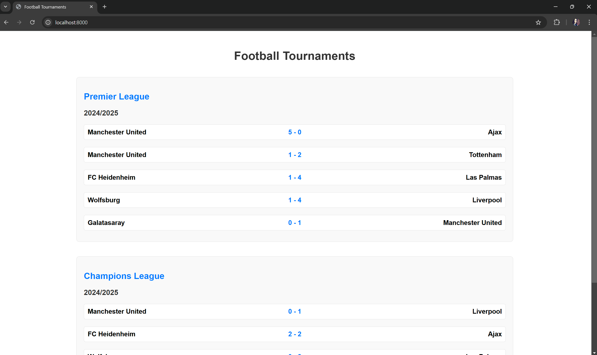

# Football Tournaments Results Dashboard

This project is a Laravel-based web application that provides live match results from various leagues across different seasons. Every minute, the app retrieves and displays updated results for different matches, showing various games and their scores at random intervals.

## Features

- Display football results from different leagues.
- Automatic updates every minute.
- Supports multiple leagues and seasons.
- Provides match scores, teams, and other relevant information.
- Built with Laravel and Docker for easy deployment.

## Project Setup

### Step 1: Clone the Repository

First, clone the repository to your local machine.

```bash
git clone https://github.com/Panayotova-Tsvetelina/sports-results.git
cd sports-results
```

### Step 2: Build Docker containers

```bash
docker-compose up --build
```
### Step 3: Create DB tables

```bash
php artisan migrate:fresh
php artisan db:seed
```


